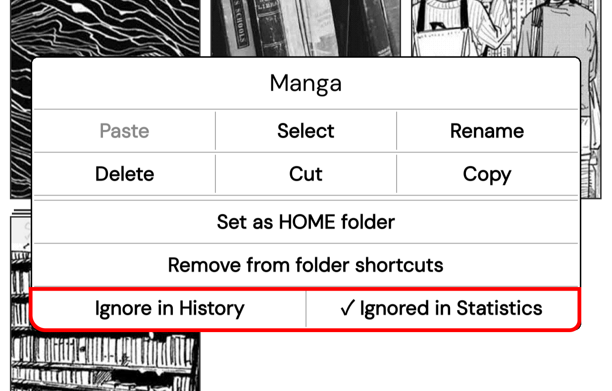
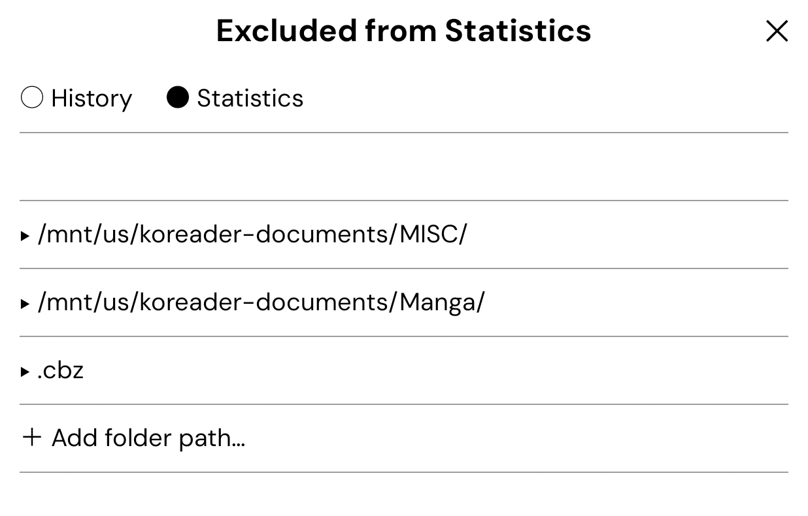

# KOReader User Patches

Small patches that extend or tweak KOReader.

---

## [🞂 2-exclude-folders](2-exclude-folders.lua) — Exclude folders & files from History and Statistics

Prevents selected folders or files from appearing in Reading History or being tracked by Reading Statistics. Settings are saved automatically — no manual file editing needed.

 

### Adding exclusions

| Method | How |
|--------|-----|
| **Long-press** a folder or file in File Manager | Buttons appear at the bottom of the context menu |
| **Tools → Exclude Folders & Files** | Full list view — add folder paths manually, remove existing entries |
| **Tools → Exclude this book…** | Available inside the reader — excludes the currently open book |

### How matching works

- **Folders** — partial match: `"Manga"` excludes everything under any path containing that word
- **Files** — exact match: only that specific file is excluded
- Matching is **case-sensitive**

### Behaviour

- **History** — excluded entries are removed the next time you open the History view
- **Statistics** — excluded files are ignored by the Statistics plugin after reopening the book
- If a file is inside an already-excluded folder, its button in the context menu will be **greyed out** — the exclusion comes from the parent folder and can't be removed directly

---

## [🞂 2-incognito](2-incognito.lua) — Open a book without leaving any trace

Opens a file in incognito mode — reading progress, history and document settings are not saved.


### How to use

**Long-press** a file in File Manager → **Open Incognito** button appears at the bottom of the context menu.

### What is blocked

| What | Behaviour |
|------|-----------|
| **Reading History** | The file is never added — not even temporarily |
| **Reading Statistics** | The file is not tracked for the duration of the session |
| **Reading progress** | Last page position is not saved |
| **Bookmarks** | Not written to disk |
| **Highlights & notes** | Not written to disk |
| **All document settings** | Nothing is written to disk for the duration of the session |

> [!IMPORTANT]
> #### incognito.koplugin
> If you prefer incognito as a plugin over a patch, download the latest `incognito.koplugin.zip` from the [Releases](https://github.com/Craftwork2720/incognito.koplugin/releases) page, unzip and copy the `incognito.koplugin` folder to the `plugins/` directory on your device. Both work identically.

---

## [🞂 2-filemanager-title-hide](2-filemanager-title-hide.lua)

Removes the large title from the File Manager without leaving empty space behind. The current path subtitle stays visible.

---

## [🞂 2-filemanager-subtitle-margin](2-filemanager-subtitle-margin.lua)

Adds horizontal padding to the file path shown in the File Manager title bar — useful when it overlaps with buttons.


> [!NOTE]
> The back arrow button comes from a separate patch by sebdelsol:
> [2-browser-up-folder.lua](https://github.com/sebdelsol/KOReader.patches/blob/main/2-browser-up-folder.lua)

---

## [🞂 1-gettext-translate](1-gettext-translate.lua) — Custom translations for patches & plugins

KOReader's built-in translation system only covers the official app — not community patches or plugins. This patch fills that gap by letting you add translations for any string marked with `_("...")` in a patch or plugin.

**How it works:** KOReader loads language files (`.po`) on startup. This patch hooks into that process and injects your custom translations right after — so they're available everywhere, without touching official files.

**Setup:**

1. Set your language at the top of the file:
```lua
local LANGUAGE = "pl"  -- "pl" = Polish, "de" = German, "fr" = French, "es" = Spanish
```
2. Add translations to the `translations` table:
```lua 
["My English string"] = "Mój polski string",
```

> [!NOTE]
> This only works for strings explicitly wrapped in `_("...")`. It does **not** auto-translate arbitrary text.
> Official KOReader translations are never overwritten.

---
