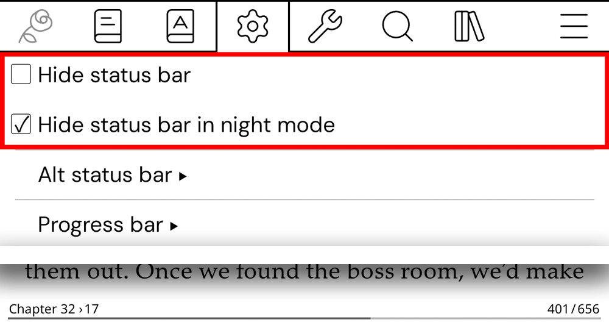
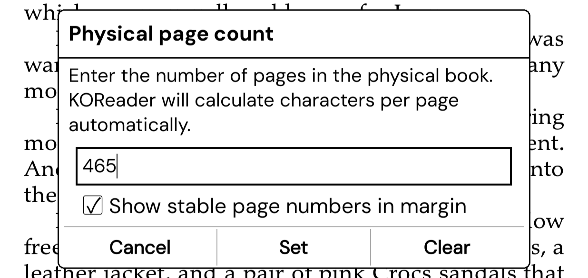

# KOReader User Patches
<br>

## [2-exclude-folders](2-exclude-folders.lua) — Exclude folders and files from History and Statistics

Prevents selected folders or files from appearing in Reading History or being tracked by Reading Statistics. Settings are saved automatically — no manual file editing required.

<picture></picture>
<picture></picture>

### Adding exclusions

| Method | How |
|--------|-----|
| **Long-press** a folder or file in File Manager | Buttons appear at the bottom of the context menu |
| **Tools → Exclude Folders & Files** | Full list view — add paths manually or remove existing entries |
| **Tools → Exclude this book…** | Available inside the reader — excludes the currently open book |

### How matching works

- **Folders** — partial match: `"Manga"` excludes everything under any path containing that word
- **Files** — exact match: only that specific file is excluded
- Matching is **case-sensitive**

### Behavior

- **History** — excluded entries are removed the next time you open the History view
- **Statistics** — excluded files are ignored after the book is reopened
- If a file is inside an already-excluded folder, its button will be **greyed out** — the exclusion is inherited from the parent folder and cannot be removed directly

---

<br>

## [2-incognito](2-incognito.lua) — Open a book without leaving any trace

Opens a file in incognito mode — nothing from the session is saved.

<picture></picture>

**Long-press** a file in File Manager → **Open Incognito** appears at the bottom of the context menu.

When you open a book via **Open Incognito**:

- no history
- no statistics
- no progress saved
- no document settings saved or modified
- no highlights or notes saved or modified
- no `.sdr` sidecar folders created or modified


>Prefer a plugin? Download [incognito.koplugin](https://github.com/Craftwork2720/incognito.koplugin). Identical functionality, with an icon displayed when saves are blocked. <picture></picture>

>
>[](https://github.com/Craftwork2720/incognito.koplugin/releases/latest/download/incognito.koplugin.zip)


---

<br>

## [2-hide-status-bar](2-hide-status-bar.lua) — Hide status bar ( 3 actions + auto-hide in night mode )

Hides the entire status bar (footer + alt status bar for CRE documents), with auto-hide support in night mode.

<picture></picture>

### Controls

| Type | Action | Behavior |
|------|--------|----------|
| Menu | **Reader: Config → Status bar → Hide status bar** | Toggle — persisted, restored on next open |
| Menu | **Reader: Config → Status bar → Hide status bar in night mode** | Auto-hide when night mode is active |
| Gesture / Profile | **Reader → Hide status bar** | One-way: hide (not persisted) |
| Gesture / Profile | **Reader → Show status bar** | One-way: show (not persisted) |
| Gesture / Profile | **Reader → Toggle status bar visibility** | Toggle — persisted |

### Behavior

- State is **persisted across book sessions**
- For CRE documents (e-ink text rendering), also hides the alt status bar at the top
- **Hide / Show** actions do **not persist state** — intended for temporary control (gestures, profiles)
- Menu options are only available **while a book is open** 

---

<br>

## [2-physical-page-count](2-physical-page-count.lua) — Match page numbers to a physical edition

Adds a **Physical page count** option. Enter the number of pages in the physical book and KOReader automatically calculates the correct characters-per-page value so the page counter matches the printed edition.

<picture></picture>

**In-book top menu → Navigation → Physical page count…**   Opens the input dialog

---

<br>

## [2-filemanager-title-hide](2-filemanager-title-hide.lua) — Hide "KOReader" title

Removes the large title from the File Manager without leaving empty space behind. The current path subtitle remains visible.

---


<br>


## [2-filemanager-subtitle-margin](2-filemanager-subtitle-margin.lua) — Cosmetic fix

Adds horizontal padding to the file path shown in the File Manager title bar — useful when it overlaps with buttons.

<picture></picture>

> [!NOTE]
> The back arrow button comes from a separate patch by sebdelsol:
> [2-browser-up-folder.lua](https://github.com/sebdelsol/KOReader.patches/blob/main/2-browser-up-folder.lua)

---


<br>


## [1-gettext-translate](1-gettext-translate.lua) — Custom translations for patches and plugins

Lets you add translations for any string in a community patch or plugin — without modifying any official KOReader files.

**Setup:**

1. Set your language at the top of the file:

```lua
local LANGUAGE = "pl"  -- "pl" = Polish, "de" = German, "fr" = French, "es" = Spanish
```

2. Add your translations to the `translations` table:

```lua
["My English string"] = "Mój polski string",
```

> [!NOTE]
> This only works for strings explicitly wrapped in `_("...")`. Official KOReader translations are never overwritten.